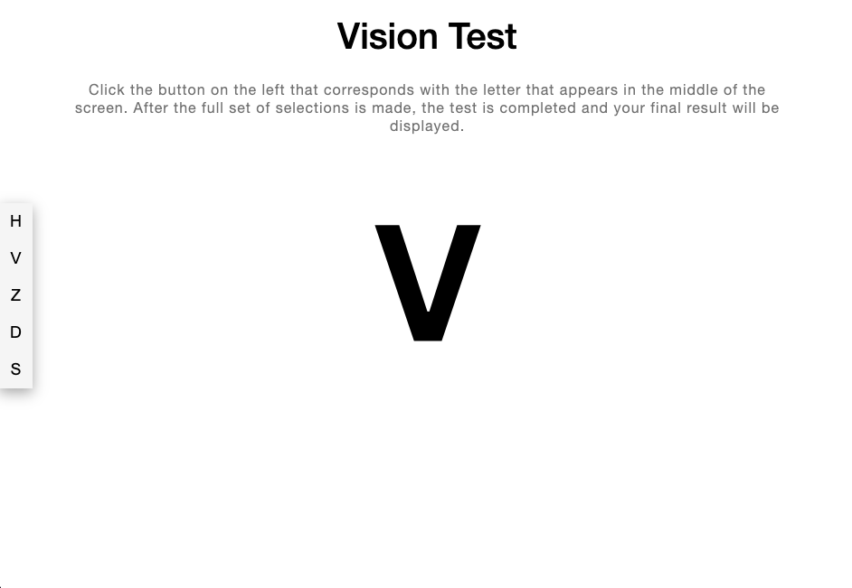

<div align="center">

# Visibly Vision Test Exercise

### _The goal of this exercise is to create a web-based vision test that an end-user can complete._

  </div>
  
  ## Table of Contents
  
  - [Media](#Media)

- [Userstory](#user-story)

- [Deployment](#Deployment)

- [Contributors](#Contributors)

- [Contact](#Contact)

- [Project Status](#project-status)

## Media



## User Story

```
As a user, I want to see a randomized optotype character in the center of the vision test page.

As a user, I want to be able to select which optotype that I see by clicking the corresponding button on the vision test page.

### As a user, I want to be able to complete a vision test by making the full set of selections on the vision test page.
```

## Deployment

[Deployment is coming soon. In the meantime, Here is the link to view my portfolio.](https://celestealexmoore.github.io/portfolio_3.0/)

## Contributors

This application was created by Celeste Moore.

## Contact

If you have any questions about this repository, contact celestealexmoore via GitHub or reach out via email:
celestealexmoore@gmail.com.

## Project Status

Nearly Complete

---

2023 _celestealexmoore_
